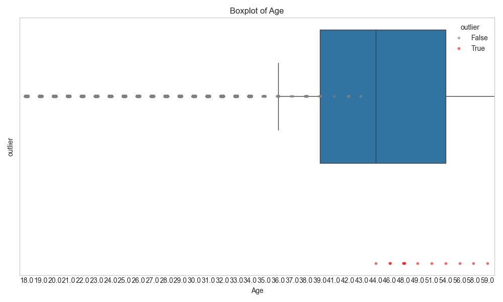
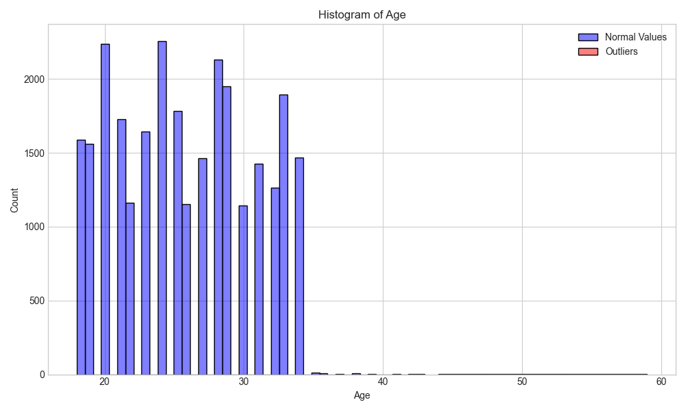
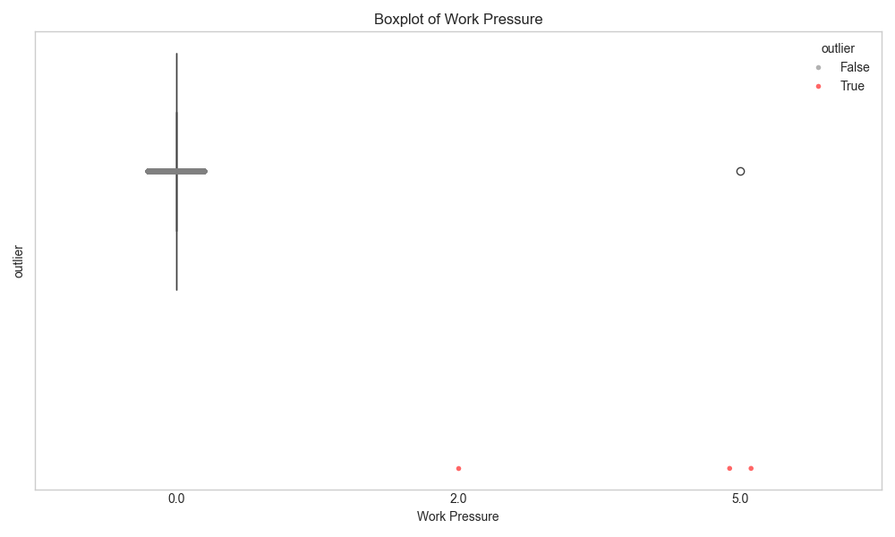
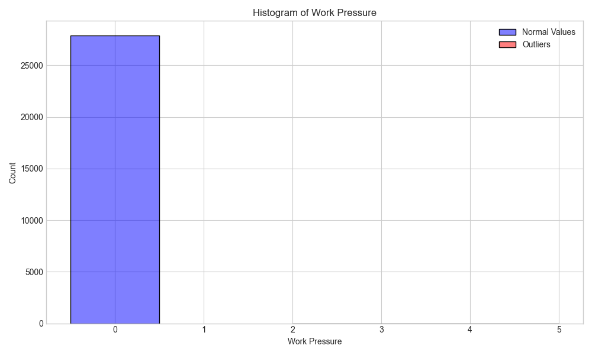
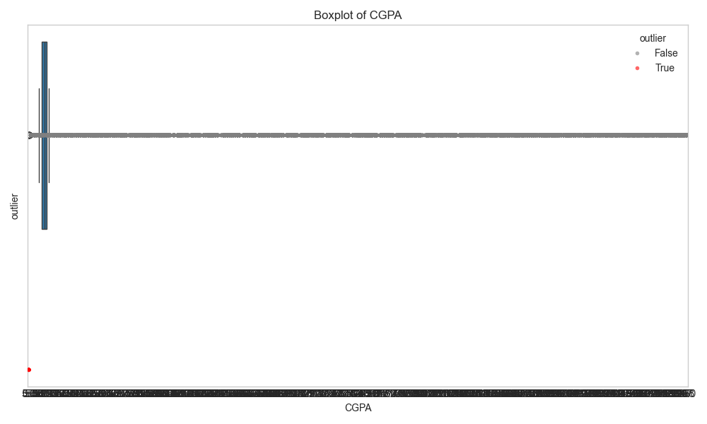
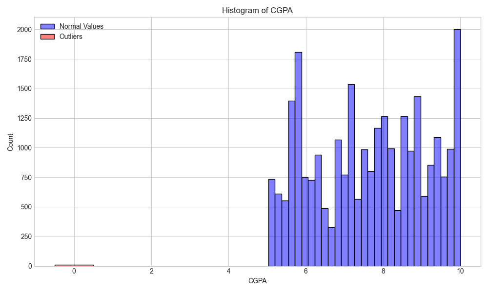
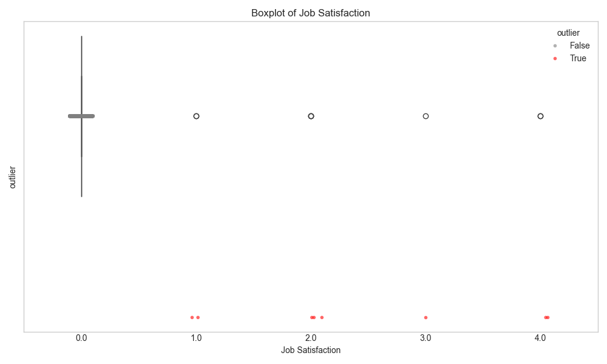
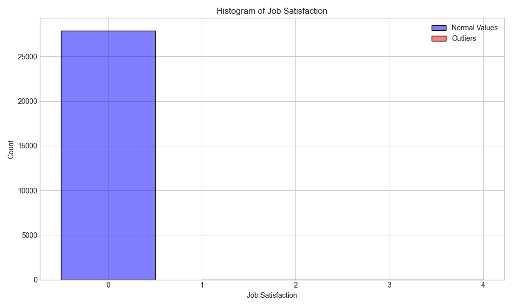

# Outlier Analysis Report: Student Depression Dataset

## Executive Summary

This report details the outlier detection and treatment process for the Student Depression Dataset. Out of 27901 records, 32 outliers were identified across various features. After treatment, 23 records were removed, and several values were capped to appropriate bounds. The treated dataset maintains 27878 records (99.92% of original data) for subsequent analysis.

## Outlier Detection Methodology

Two standard methods were employed for outlier detection:

1. **Z-score Method**: Identifies data points that are more than 3 standard deviations away from the mean
2. **Interquartile Range (IQR) Method**: Identifies data points that fall below Q1 - 1.5�IQR or above Q3 + 1.5�IQR

For each feature, the most appropriate method was selected based on data distribution and context.

## Detailed Findings

### Age

- **Detection Method**: IQR
- **Outliers Found**: 12 (0.04% of data)
- **Treatment**: Removed 12 rows
- **Impact on Statistics**:
  - Before: Mean = 25.82, Std = 4.91, Min = 18.00, Max = 59.00
  - After: Mean = 25.81, Std = 4.88, Min = 18.00, Max = 43.00

### Work Pressure

- **Detection Method**: IQR
- **Outliers Found**: 3 (0.01% of data)
- **Treatment**: Removed 3 rows
- **Impact on Statistics**:
  - Before: Mean = 0.00, Std = 0.04, Min = 0.00, Max = 5.00
  - After: Mean = 0.00, Std = 0.00, Min = 0.00, Max = 0.00

### CGPA

- **Detection Method**: IQR
- **Outliers Found**: 9 (0.03% of data)
- **Treatment**: Removed 6 rows
- **Impact on Statistics**:
  - Before: Mean = 7.66, Std = 1.47, Min = 0.00, Max = 10.00
  - After: Mean = 7.66, Std = 1.46, Min = 5.03, Max = 10.00

### Job Satisfaction

- **Detection Method**: IQR
- **Outliers Found**: 8 (0.03% of data)
- **Treatment**: Removed 2 rows
- **Impact on Statistics**:
  - Before: Mean = 0.00, Std = 0.04, Min = 0.00, Max = 4.00
  - After: Mean = 0.00, Std = 0.00, Min = 0.00, Max = 0.00

## Recommendations

Based on the outlier analysis, we recommend:

1. Using the treated dataset for all subsequent analyses
2. Paying special attention to features with high outlier percentages in modeling
3. Consider the potential impact of outlier treatment on model interpretation

